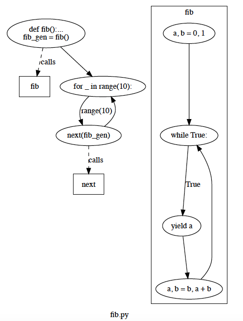

# StatiCFG

forked from https://github.com/coetaur0/staticfg

Python3 control flow graph generator

StatiCFG is a package that can be used to produce control flow graphs (CFGs) for Python 3 programs. The CFGs it generates
can be easily visualised with graphviz and used for static analysis. This analysis is actually the main purpose of
the module, hence the name of **StatiC**FG.

Below is an example of a piece of code that generates the Fibonacci sequence and the CFG produced for it with StatiCFG.

```python
def fib():
    a, b = 0, 1
    while True:
        yield a
        a, b = b, a + b

fib_gen = fib()
for _ in range(10):
    next(fib_gen)
```



## Installation

To install StatiCFG, simply clone this repository and run the command `pip3 install --upgrade .` inside of it. Please note that
you will also need to install [Graphviz](https://www.graphviz.org/) on your machine to be able to visualise the control flow
graphs generated by StatiCFG.

## Usage

To use StatiCFG, simply import the module in your Python interpreter or program, and use the `staticfg.CFGBuilder` class to 
build CFGs. For example, to build the CFG of a program defined in a file with the path *./example.py*, the following code can 
be used:

```
from staticfg import CFGBuilder

cfg = CFGBuilder().build_from_file('example.py', './example.py')
```

This returns the CFG for the code in *./example.py* in the `cfg` variable. The first parameter of `build_from_file` is the 
desired name for the CFG, and the second one is the path to the file containing the source code. The produced CFG can then be 
visualised with:

```
cfg.build_visual('exampleCFG', 'pdf')
```

The first paramter of `build_visual` is the desired name for the DOT file produced by the method, and the second one is the
format to use for the visualisation.

The *build_cfg.py* script present in the */examples* folder of this repository can be used to directly generate the CFG of some 
Python program and visualise it. To do so, simply call the script with the command `python3 build_cfg.py 
<path_to_some_source>`.
